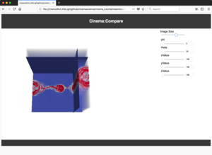

# Cinema Tutorial, SuperComputing 2019

Cinema Tutorial for Supercomputing 2019 in Denver, CO. 

- [Tutorial Slides](https://github.com/cinemascience/cinema_tutorial_slides/blob/master/2019-11_SC19/tutorial_sc19.pdf)

## Simple Cinema Examples

These are examples of simple Cinema databases, showing the flexibility and power of the image-based approach. The last example shows a multi-artifact database, with data-specific viewers.

<table cellspacing="10">

<tr>
<td></td>
<td></td>
<td></td>
</tr>

<tr>
<td align="center">Halo Dataset</td>
<td align="center">Volume Dataset</td>
<td align="center">Multi-artifact</td>
</tr>

</table>

## Tutorial Workflow Examples
- [example](materials/example_compare.html)
- [explorer](materials/cinema_explorer.html)

